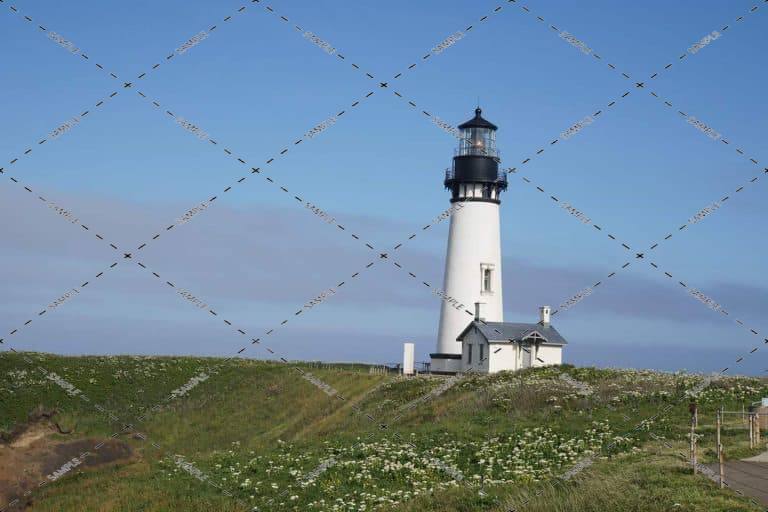

# WatermarksDelete

Project Advanced AI - ISEN M2

Team :

-   Nicolas Broage
-   Antoine Maes
-   Louis Lecouturier

# Fonctionnement du projet

Pour fonctionner, le projet necessite :

-   les datasets
-   les models
-   le fichier de config
-   la pipeline

# Installation

## Prérequis

-   Python 3.11
-   Poetry

## Installation

### Dépendances

```bash
poetry install
```

### Téléchargement des modèles et des datasets

Les modèles et les datasets sont disponibles dans le drive suivant :
https://drive.google.com/drive/folders/19uRZ9-qzWo87gAdq3nTOx-J3C33dZP5J?usp=drive_link

## Lancement

Environnement virtuel

```bash
poetry shell
```

Lancement du programme

```bash
python main.py
```

## Les datasets

Le dataset vient de : https://github.com/hukenovs/hagrid?tab=readme-ov-file (No Gesture version)

Le dataset contenant les images avec watermarks est disponible dans le drive.
Ce dataset a été généré avec le script `scripts/dataset_scripts/apply_watermarks.py` qui applique des watermarks sur toutes les images du dataset.

Les autres dossiers du dataset sont générés par les scripts suivants :

-   `scripts/dataset_scripts/set_dataset.py`: permet de créer les dossiers de test et de validation pour les entrainements des modèles
-   `scripts/dataset_scripts/set_w_remove_dataset.py`: permet d'avoir un dossier d'images traitées par le modèle de suppression des filigranes.

<!-- 

 -->

## Les modèles

Les modèles entrainés sont diponible dans le Drive pour éviter d'avoir à les ré-entrainer.
Il y a 2 modèles :

-   `models/autoencoder_model.keras`: modèle d'autoencodeur de défloutage (généré par le notebook `deblurring.ipynb`)
-   `models/cnn_encoder.h5` : modèle d'encodeur convolutif qui enlève les watermarks (généré par le notebook `remove_watermarks.ipynb`)

## La Pipeline

Le script `main.py` contient une pipeline qui prend une image filigranée en entrée et la fait passer dans les modèles de removal watermarks, de deblurring et d'upscaling.

Les sorties sont disponibles dans le dossier `output`.
